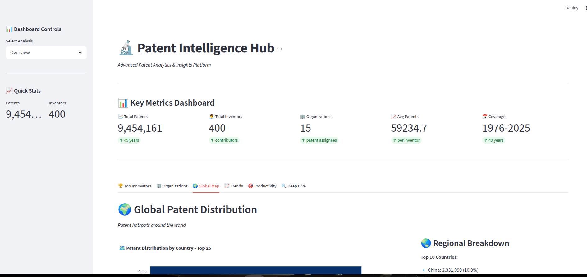

# GLOBAL PATENT INTELLIGENCE DATA PIPELINE

**PROJECT OVERVIEW**
This project implements a complete data engineering pipeline that collects, 
cleans, stores, and analyzes patent data using Python, pandas, SQL, and 
interactive visualizations.

# LIMITATIONS
1. My machine was not able to run the pipeline as my resources were limited. I ran the file on kaggle since it has enough resources, then downloded the output.
2. The clean_patents.csv was too big to push to github, Github has a limit of each file being 100mbs, the file is 720mbs.
3. Deploying the dashboard proved difficult. The database was too big to be deployed(8.9GB). I was able to delpoy the dashboard but it cannot access the database.

**KEY LINKS**

1. INTERACTIVE DASHBOARD:
   https://cloudpatentpipeline-gy8xprrrcpniykfyy2aukb.streamlit.app/

2. GITHUB REPOSITORY:
   https://github.com/ArindaAsiimwe/cloud_patent_pipeline

# QUICK START GUIDE

1. INSTALL DEPENDENCIES:
   pip install pandas matplotlib seaborn streamlit plotly

2. RUN PIPELINE (on Kaggle or locally):
   python3 patent_pipeline.py
   
   This will:
   - Load and clean data
   - Create SQLite database with normalized schema
   - Run SQL queries
   - Generate output CSVs and reports
   - Create static visualizations

3. LAUNCH INTERACTIVE DASHBOARD:
   streamlit run dashboard.py
   

4. VIEW STATIC CHARTS:
   See generated PNGs in output/ folder

5. GENERATE REPORTS:
   Console report is printed during pipeline execution
   JSON report saved to output/report.json

# INTERACTIVE DASHBOARD FEATURES

The Streamlit dashboard provides real-time patent analytics with 6 unique tabs:

**KEY METRICS DASHBOARD:**
   ✓ Total Patents - Total number of patent records
   ✓ Total Inventors - Number of unique inventors
   ✓ Organizations - Count of companies/assignees
   ✓ Avg Patents - Average patents per inventor
   ✓ Coverage - Time period span (min-max years)

1. TAB 1: TOP INNOVATORS
   ✓ Bar chart showing top 20 patent inventors
   ✓ Ranked display with patent counts
   ✓ Country of origin for each inventor
   ✓ Quick stats: leader, median, average

2. TAB 2: ORGANIZATIONS
   ✓ Scatter plot visualization of top 30 companies
   ✓ Bubble sizing by patent count
   ✓ Color gradient showing patent distribution
   ✓ Top 10 organizations list with progress bars

3. TAB 3: GLOBAL MAP
   ✓ Horizontal bar chart of top 25 countries
   ✓ Patent concentration by nation
   ✓ Regional breakdown with percentages
   ✓ Diversity metrics and coverage analysis

4. TAB 4: TRENDS & FORECASTING (Advanced)
   Subtab 1 - Historical Data:
   ✓ Area chart showing patent filings over time
   ✓ Complete historical trend visualization
   
   Subtab 2 - AI Predictions:
   ✓ Linear regression forecast for next 5 years
   ✓ Historical + predicted data comparison
   ✓ R² score showing prediction accuracy
   ✓ Forecasted patent counts for future years
   
   Subtab 3 - Analytics:
   ✓ 5-year growth rate calculation
   ✓ Peak year and peak value metrics
   ✓ Volatility analysis (standard deviation)
   ✓ Decade-by-decade comparison

5. TAB 5: PRODUCTIVITY ANALYSIS
   ✓ Bar chart: Average patents per inventor by country
   ✓ Scatter plot: Inventor count vs productivity correlation
   ✓ Regional comparison with bubble sizing
   ✓ Identifies most and least productive patent ecosystems

6. TAB 6: DEEP DIVE (Advanced Analytics)
   5 Custom Analysis Modes:
   
   1. Inventor Rankings by Country
      - Select any country to see top inventors
      - Detailed ranking with patent counts
      - Country-specific analysis
   
   2. Company Patent Distribution
      - Complete list of all organizations
      - Full dataset with counts
      - Exportable data view
   
   3. Yearly Growth Rates
      - Year-over-year growth calculations
      - Trend line with spline smoothing
      - Identifies growth patterns
   
   4. Patent Distribution Analysis
      - Histogram of patent distribution
      - Statistical metrics (mean, median, std dev)
      - Distribution shape analysis
   
   5. Top Countries Comparison
      - Side-by-side country metrics
      - Grouped bar charts
      - Comparative analysis

GitHub: https://github.com/ArindaAsiimwe/cloud_patent_pipeline

